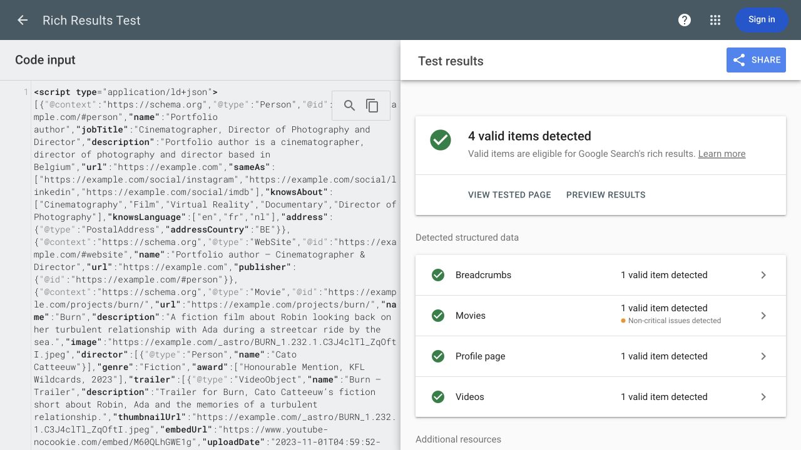

# Phase 5 validation — 30 September 2026

Implementation is finished locally. Automated verification passes. GA4 account confirmation, physical-device checks, and live checks after publication remain outstanding. No commit, push, or deployment was performed; earlier Phase 4 edits remain in the working tree.

## Metadata and source contracts

- Removed the unsupported `cinematographer` property and unconditional creator claim. Movies record the supplied directors, plus `contributor` and `creditText` matching the visible role. The VR CreativeWork records its actual co-creators without Movie-only director/trailer properties.
- Exact project names come from content rather than parsing SEO titles. Film creation/release dates remain omitted without verified complete dates; award years are not used as release dates.
- All four videos have provider-verified publication dates, individual descriptions, and consistent titles in the player and JSON-LD. Provider-specific IDs are validated by the same contract used for playback.
- Site identity, contact, site URL, and social URLs share configuration. Curated SEO titles, routes, canonicals, and the 404 noindex behavior are preserved.
- Public social images are explicitly registered and checked on disk. Managed images use the manifest/optimizer; failures no longer silently become incorrect public URLs. BTS metadata image failures also propagate.
- The local official-vocabulary checker accepted **228 typed nodes across 21 pages**. It checks known types/properties and inherited property domains; it does not validate every possible value or determine search eligibility.

Google's Rich Results Test accepted an anonymized sample with the emitted Burn Movie/trailer, Person/WebSite references, About ProfilePage, and BreadcrumbList structure: **four valid items**, with one non-critical Movie warning for missing optional `dateCreated`. No film creation date was invented. Names, personal social URLs, and site-host references were replaced with generic values before submission. This is a code-structure test, not a live crawl of the updated website; production images and indexing require checks after publication. VR, home ItemList, and BTS ImageGallery were checked locally against the vocabulary and built-site tests.

[Google test result](https://search.google.com/test/rich-results/result?id=RGuHQzyYWPLvhcYuWVjuOA).

## Verified video dates and manual player checks

Provider pages/oEmbed responses were read on 30 September 2026. Vimeo supplied no verified timezone, so its dates retain day precision. Dates describe these particular trailers, not film release dates.

| Video | Verified upload date | Manual result from the local site |
| --- | --- | --- |
| Burn — YouTube M60QLhGWE1g | 2023-11-01T04:59:52-07:00 | Playback reached the end; settings offer Dutch auto-generated captions and auto-translation. |
| Ever Since, I Have Been Flying — YouTube U_bi7vFrMqY | 2023-11-01T04:24:03-07:00 | Playback started; the player explicitly reports no selectable subtitles available. |
| Chance Encounters — Vimeo 493296509 | 2020-12-21 | Playback progressed; English (United States) subtitles were offered and enabled. |
| Les Homards Immortels — Vimeo 206725218 | 2017-03-04 | Playback started; no CC control or subtitle setting was offered. |

Both providers use a local poster and keyboard-operable activation button. No provider player is loaded before activation. Direct watch links remain visible after activation, on simulated provider failure, and without JavaScript. Activated providers may make their own third-party requests. Captions are provider-managed: selectable tracks are absent on two videos, and Burn's track is automatic. Caption accuracy, baked-in text, and accessibility of the third-party controls have not been certified.

## Analytics

The selected policy is **GA4 with visitor opt-in**. The script loads only after Allow analytics on the configured production hostname. Development, local production previews, and other hosts stay untracked. The footer exposes Analytics settings; withdrawal disables reporting, clears the site's GA cookies, and prevents further manual page-view events. Ads storage and personalization remain denied. Storage failure retains a visit-only choice.

One manual page-view mechanism records origin/path/query changes after Astro page loads. Fragment-only contact/gallery changes are ignored. The loader persists across transitions without being re-executed. Tests cover direct load, project navigation, About/contact, back/forward, duplicate lifecycle events, saved decline, changed choice, withdrawal, re-opt-in, and local-preview guards. Production-host tests proxy the hostname to the local build and mock Google: **no actual telemetry is sent by these browser tests**.

**Required before publication:** confirm that GA4 Enhanced measurement → Page views → **Page changes based on browser history events** is disabled. The account setting was not accessible and has not been confirmed. `send_page_view: false` alone does not disable that history setting. Verify real delivery/deduplication using DebugView or Realtime after the account configuration is confirmed. [Google page-view guidance](https://developers.google.com/analytics/devguides/collection/ga4/views), [reporting opt-out flag](https://developers.google.com/tag-platform/security/guides/privacy).

## Automated verification

- Clean `npm ci --prefer-offline` with pinned Node 22.23.3: succeeded; **zero dependency vulnerabilities** reported. Superseded analytics/YouTube packages and their unused embed dependency were removed.
- Astro check: **74 files, zero errors/warnings/hints**.
- Production build: **21 pages**, with image generation and pruning successful.
- Vitest: **197 passed across 12 files**, including content, metadata, route/asset, credit, video-date, source-image, and analytics-policy checks.
- Playwright: **240 passed** across desktop/mobile Chromium, Firefox, and WebKit. Includes axe checks, all-route/local-asset verification, keyboard/focus behavior, blocked-player fallback, analytics consent, no-JavaScript and reduced-motion checks.
- Layout coverage includes 320/390/768/1280 CSS-pixel viewports and a 640×360 viewport representing the available CSS layout space of a 1280×720 desktop at 200% zoom. This is zoom-equivalent reflow coverage, not a physical browser/device zoom certification.

## Performance evidence

Lighthouse **13.0.3**, Chromium from locked Playwright **1.63.0**, three cold runs per route, median results. Both builds used separate instances of the same local static server. Settings matched exactly: 390×844 mobile viewport, DPR 2, simulated 150ms RTT / 1638.4 Kbps throughput / 4× CPU slowdown. Network audit evidence confirms **zero third-party response bytes** in all 24 retained runs.

| Route | Median LCP, before → after | Median CLS, before → after | Median TBT, before → after | Total transfer, before → after |
| --- | --- | --- | --- | --- |
| Home | 3.829s → 3.756s | 0.000 → 0.000 | 0ms → 0ms | 519.9 → 525.4 KiB |
| Ever Since, I Have Been Flying (39 stills) | 4.503s → 4.504s | 0.000 → 0.000 | 0ms → 0ms | 614.0 → 652.3 KiB |
| BTS | 5.330s → 5.332s | 0.022 → 0.022 | 0ms → 0ms | 821.1 → 826.6 KiB |
| About | 3.377s → 3.379s | 0.000 → 0.000 | 0ms → 0ms | 397.0 → 402.6 KiB |

The isolated comparison shows essentially unchanged initial-load performance. The new consent/player implementation adds about 5.6 KiB of local transfer on home, BTS, and About. The documentary route also downloads its new local player poster; its total increase is about 38.4 KiB. Third-party player/tracking traffic is deliberately blocked in both comparisons, so those potential real-world savings are not quantified here. No performance speedup is claimed.

Lab LCP remains above 2.5 seconds under these settings; this phase does not establish the field LCP target. No field p75 data or INP was collected. TBT is a lab responsiveness metric, not INP. CLS stayed stable. [Lighthouse scoring/method limitations](https://developer.chrome.com/docs/lighthouse/performance/performance-scoring), [Web Vitals field targets](https://web.dev/articles/vitals).

Raw evidence: [before](evidence/phase-5/performance-before.json), [after](evidence/phase-5/performance-after.json). `scripts/measure-performance.mjs` reproduces the measurements and rejects successful third-party responses/transfers. Three initial Burn measurements were also taken, but the retained comparison uses the planned 39-still documentary route.

Earlier measurements with a malformed comma-separated provider block list were discarded. The first baseline may have recorded up to twelve synthetic localhost visits in the existing GA4 property; exclude those local visits when reviewing analytics. The corrected runner supplies individual blocking patterns and rejects a run if the network audit reports any third-party response or transfer.

## Remaining release checks

1. Confirm the GA4 history setting and verify actual account delivery. Automated event-queue tests do not establish GA4 delivery.
2. Test on a physical iPhone/Safari and Android/Chrome, including actual 200% zoom, touch, video playback, and contact/navigation. Automated WebKit is supplemental evidence.
3. Review/add accurate provider caption tracks where needed. No captions were invented or uploaded.
4. After owner publication, run Rich Results Test on actual URLs, check HTTP 404 status, resolve canonical/social images from the public host, and verify interactions and tracking against this build. Search enhancements are not guaranteed by valid markup.
5. The earlier eleven missing project years/current-status confirmations remain editorially pending. No guesses were added.

Sources: [Movie vocabulary](https://schema.org/Movie), [director domains](https://schema.org/director), [contributor](https://schema.org/contributor), [trailer domains](https://schema.org/trailer), [Google video requirements](https://developers.google.com/search/docs/appearance/structured-data/video), [ProfilePage guidance](https://developers.google.com/search/docs/appearance/structured-data/profile-page), [YouTube player parameters](https://developers.google.com/youtube/player_parameters).
